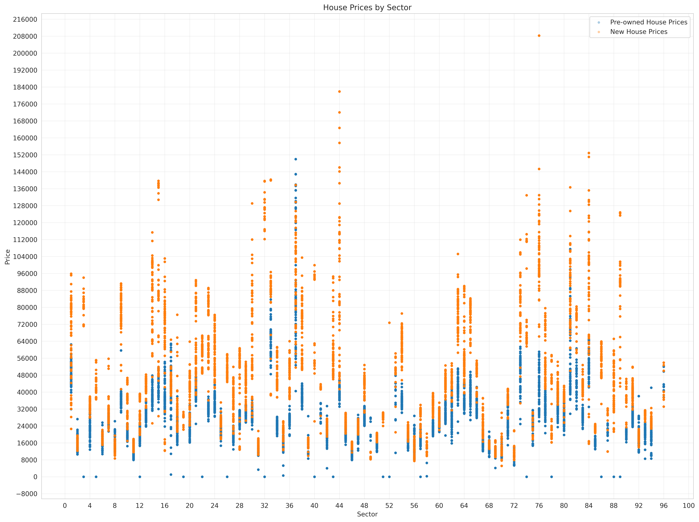

  <h1>🏘️ China Real Estate Demand Prediction</h1>
  
  
  
  
  
  
    
  <strong>Accurate monthly forecasting of new residential property sales across 96 Chinese city sectors using XGBoost and extensive feature engineering</strong>
    
  <strong>Final Private LB Score: 0.7785</strong> • <strong>Validation RMSE: 13,436</strong> • <strong>R²: 0.868</strong>
    
  <a href="#quick-start">🚀 Quick Start</a> •
  <a href="#dataset">📊 Dataset</a> •
  <a href="#exploratory-data-analysis">🔬 EDA</a> •
  <a href="#feature-engineering">🔧 Features</a> •
  <a href="#model">🤖 Model</a> •
  <a href="#results">📈 Results</a>

<h2>🎯 Overview</h2>

This repository contains a complete, high-performing solution for the Kaggle competition <strong>China Real Estate Demand Prediction</strong>.

The task is to predict the <strong>monthly sales volume (in units)</strong> of newly built private residential projects for each of 96 city sectors, using rich historical transaction data, economic indicators, points of interest (POI), land records, and search trends from 2019–2024.

The solution achieves strong performance with a single <strong>XGBoost Regressor</strong> optimized via Bayesian search, extensive lag/rolling/spatial features, and careful time-series validation.

<h3>Key Results</h3>
<table>
  <tr><th>Metric</th><th>Value</th></tr>
  <tr><td>Validation RMSE</td><td>13,436.36</td></tr>
  <tr><td>Validation R²</td><td>0.8681</td></tr>
  <tr><td>Custom Competition Score (Private LB)</td><td><strong>0.7785</strong></td></tr>
  <tr><td>Number of Features</td><td>194</td></tr>
  <tr><td>Training Rows</td><td>212,928</td></tr>
  <tr><td>Validation Rows</td><td>53,232</td></tr>
</table>

<h2 id="dataset">📊 Dataset</h2>

Multiple interconnected CSV files (provided by the competition):

<table>
  <tr><th>File</th><th>Description</th></tr>
  <tr><td><code>new_house_transactions*.csv</code></td><td>Monthly sales of new residential units</td></tr>
  <tr><td><code>pre_owned_house_transactions*.csv</code></td><td>Secondary market transactions</td></tr>
  <tr><td><code>land_transactions*.csv</code></td><td>Land parcel sales and planned construction</td></tr>
  <tr><td><code>sector_POI.csv</code></td><td>Density of schools, hospitals, transit, etc.</td></tr>
  <tr><td><code>city_indexes.csv</code></td><td>Macro indicators (GDP, population, income, CPI)</td></tr>
  <tr><td><code>city_search_index.csv</code></td><td>Baidu search trends for real-estate keywords</td></tr>
</table>

<h2 id="exploratory-data-analysis">🔬 Exploratory Data Analysis</h2>

Comprehensive EDA with price distributions, transaction volumes, temporal trends, correlation heatmaps, 279 box plots, and 24 Q-Q plots (all saved in <code>/images</code>).

   
  <em>Figure 1: New vs Pre-owned house prices across sectors</em>  
   
  <em>Figure 2: Mean transaction prices over time</em>

<h2 id="feature-engineering">🔧 Feature Engineering</h2>
<ul>
  <li><strong>Temporal:</strong> 1/3/6/12-month lags, rolling mean/std, MoM/QoQ/YoY growth rates, cyclical month/year encoding</li>
  <li><strong>Spatial:</strong> Aggregated metrics from nearby sectors, POI densities (education, medical, transportation, commercial)</li>
  <li><strong>Economic:</strong> GDP, population, income, retail sales, CPI, search indexes</li>
</ul>

<strong>Total engineered features: 194</strong>

<h2 id="model">🤖 Model</h2>

<strong>XGBoost Regressor</strong> with Tweedie objective and Bayesian hyperparameter optimization (scikit-optimize).

Key hyperparameters:

<ul>
  <li>learning_rate=0.0238</li>
  <li>n_estimators=1222</li>
  <li>max_depth=6</li>
  <li>tweedie_variance_power=1.4</li>
  <li>early_stopping_rounds=50</li>
</ul>

Training uses <code>TimeSeriesSplit</code> cross-validation per sector to prevent leakage.

<h2 id="quick-start">🚀 Quick Start</h2>

<strong>Easiest way:</strong> Open in Google Colab

  

<ol>
  <li>Clone the repo <code>git clone https://github.com/Mathavk1606/Real-Estate-Demand-Prediction.git</code></li>
  <li>Install dependencies <code>pip install -r requirements.txt</code></li>
  <li>Place competition data in <code>/train</code> and <code>/test</code></li>
  <li>Run the notebook → generates <code>submission.csv</code></li>
</ol>

<h2 id="results">📈 Results</h2>
<ul>
  <li><strong>Validation RMSE:</strong> 13,436.357</li>
  <li><strong>R² Score:</strong> 0.8681</li>
  <li><strong>Private Leaderboard Score:</strong> 0.7785</li>
</ul>

<h2>🏆 Competition</h2>

<a href="https://www.kaggle.com/competitions/china-real-estate-demand-prediction">China Real Estate Demand Prediction @ Kaggle</a>

<h2>🛠 Technologies Used</h2>
<ul>
  <li>Data: Polars, Pandas, NumPy</li>
  <li>ML: XGBoost, scikit-learn</li>
  <li>Viz: Matplotlib, Plotly</li>
</ul>

<h2>🤝 Contributing</h2>

Contributions are welcome! Feel free to open issues or PRs for:

<ul>
  <li>Additional interaction features</li>
  <li>Ensemble / stacking models</li>
  <li>Deep learning baselines (LSTM, Transformer)</li>
  <li>Automated feature selection</li>
</ul>

<h2>📝 License</h2>

MIT License – see <a href="LICENSE">LICENSE</a>

  
<strong>⭐ Star this repo if you find it useful!</strong>

  
Made with ❤️ for the real estate analytics community

